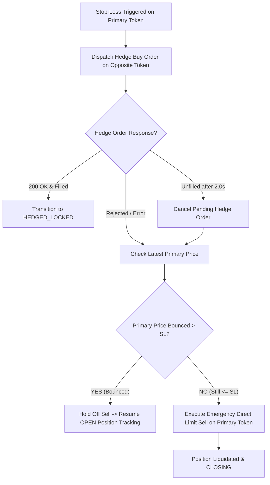

# Implementation Plan: Synthetic Hedge Fail-Safe, 2s Timeout & Bounce Recovery

## Objective
Enhance Method 3 (Synthetic Stop-Loss Cross-Hedge) with a robust multi-tier fail-safe architecture:
1. **Primary Action**: Attempt Marketable Buy on opposite token at $(\text{Trigger} + \text{Hedge Slippage})$.
2. **Rejection Catch**: If the hedge order is rejected or fails, perform a **Pre-Sell Bounce Check**:
   - If primary price bounced back $> \text{SL\_Price}$, **hold off sell** and maintain the `OPEN` position.
   - If primary price is still $\le \text{SL\_Price}$, execute an emergency **Direct Limit Sell** of the primary token.
3. **2-Second Unfilled Timeout**: If the hedge order is posted but remains unfilled for $> 2.0\text{ seconds}$, cancel the hedge order and perform the same **Pre-Sell Bounce Check** before deciding whether to resume `OPEN` or liquidate.

---

## State Machine & Execution Flow



---

## Detailed Step-by-Step Logic

### Step 1: Hedge Order Dispatch (`PENDING_HEDGE`)
When `current_bid <= Stop_Loss_Price`:
- Bot posts Limit Buy on `Opposite_Token_Id` at $\min(0.99, (1.00 - \text{SL\_Price}) + \text{v3\_hedge\_slippage\_cents})$.
- Sets position state:
  ```python
  pos["Position_Status"] = "PENDING_HEDGE"
  pos["Hedge_Order_Id"] = hedge_order_id
  pos["Hedge_Timestamp_Sec"] = time.time()
  ```

---

### Step 2: Evaluation on Incoming Market Ticks (`_evaluate_pending_hedge`)
On each subsequent WebSocket tick while `Position_Status == "PENDING_HEDGE"`:
1. **Fill Check**:
   - Query order status on exchange or check if opposite conditional tokens are held.
   - If filled $\rightarrow$ Transition to **`HEDGED_LOCKED`** (Delta-Neutral lock).
2. **2.0-Second Timeout Exceeded**:
   - If `(time.time() - pos["Hedge_Timestamp_Sec"]) >= 2.0`:
     - Cancel the unfilled hedge order via `DELETE /orders`.
     - Proceed to **Pre-Sell Bounce Check**.

---

### Step 3: Pre-Sell Bounce Check Logic
Whenever the hedge order fails, is rejected, or times out after 2.0s:

```python
latest_primary_bid = current_bid or current_price

if latest_primary_bid > pos["Stop_Loss_Price"]:
    # BOUNCE DETECTED: Market recovered above Stop-Loss!
    logger.info(
        f"💚 [BOUNCE RECOVERY DETECTED] Primary price (${latest_primary_bid:.4f}) recovered "
        f"above SL (${pos['Stop_Loss_Price']:.4f}). Holding off direct sell & resuming OPEN position."
    )
    pos["Position_Status"] = "OPEN"
    pos["Hedge_Order_Id"] = None
    # Resume normal Trailing Stop Loss & Take Profit tracking
else:
    # NO BOUNCE: Price is still falling -> Emergency Direct Sell!
    logger.warning(
        f"🚨 [EMERGENCY DIRECT SELL] Primary price (${latest_primary_bid:.4f}) is still <= SL "
        f"(${pos['Stop_Loss_Price']:.4f}). Liquidating primary position immediately."
    )
    self._execute_direct_sell_liquidation(pos, current_bid, current_ask)
```

---

## Proposed Changes

### Strategy Layer

#### [MODIFY] [`src/execution/strategy.py`](file:///Users/kamalasahu/polymarket-bot-v3/src/execution/strategy.py)
1. Update `_evaluate_tp_sl_exit`:
   - Initiate hedge order and set `Position_Status = "PENDING_HEDGE"`.
   - On immediate exception/rejection, run Pre-Sell Bounce Check.
2. Add `_evaluate_pending_hedge(self, current_bid, current_ask)`:
   - Checks if hedge order matched on exchange within 2.0s.
   - If 2.0s timeout reached, cancels hedge order and runs Pre-Sell Bounce Check.
3. Add `_execute_direct_sell_liquidation(self, pos, current_bid, current_ask)`:
   - Submits immediate Limit Sell on primary token at `current_bid - slippage`.

---

## Verification Plan

### Automated Unit Tests (`tests/test_settlement_tracker.py`)
1. **Test Hedge Instant Fill**: Verify status transitions to `HEDGED_LOCKED`.
2. **Test Hedge Rejection with Price Bounce**: Simulate CLOB rejection while `current_bid > SL_Price` $\rightarrow$ verify position stays `OPEN` and no direct sell is executed.
3. **Test Hedge Rejection without Bounce**: Simulate CLOB rejection while `current_bid <= SL_Price` $\rightarrow$ verify emergency direct sell is dispatched.
4. **Test 2.0s Timeout with Price Bounce**: Simulate hedge timeout after 2.1s while price bounced back $\rightarrow$ verify hedge is cancelled and position remains `OPEN`.
5. **Test 2.0s Timeout without Bounce**: Simulate hedge timeout after 2.1s while price is still depressed $\rightarrow$ verify hedge is cancelled and primary token is sold.

- Command: `./venv/bin/pytest tests/test_v2_strategy.py tests/test_v3_strategy.py tests/test_settlement_tracker.py`
